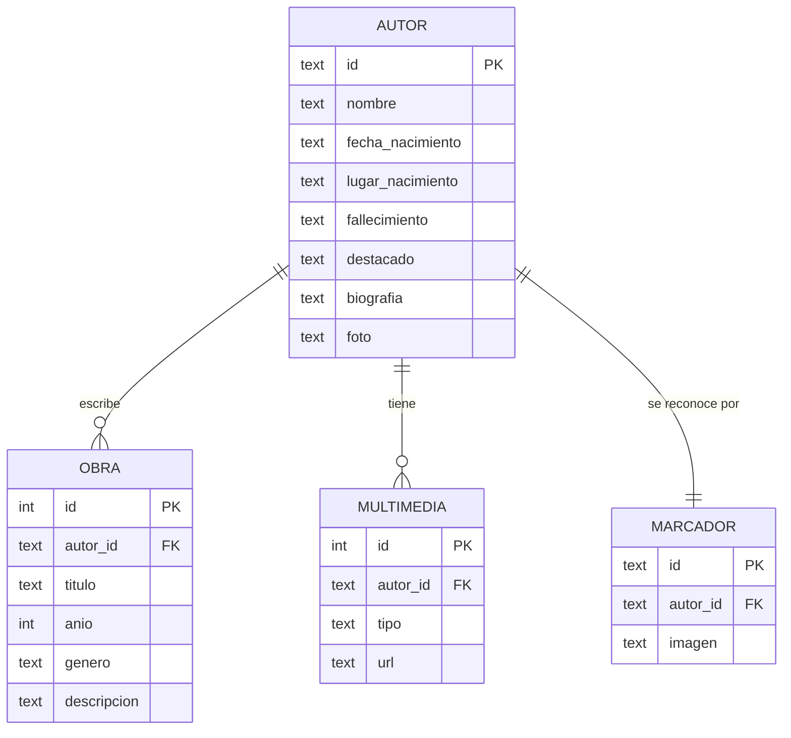

# Librarium

**Literatura Paraguaya Interactiva.** Aplicación para que estudiantes de secundaria conozcan autores
paraguayos a través de resúmenes de su vida y obra. Complementa las clases, no las reemplaza.

Tiene dos partes:

- **Galería digital**: tarjetas con cada autor; al entrar se ve su foto, datos, biografía y obras principales (y se puede escuchar la biografía).
- **Realidad aumentada**: se muestra a la cámara la ficha impresa con la foto del autor, la app la reconoce y abre su información.

Autores: Augusto Roa Bastos, Delfina Acosta, Josefina Plá y Mauricio Cardozo Ocampo.

## Tecnologías

- Java 17 con Maven
- SQLite con JDBC (`sqlite-jdbc`)
- `HttpServer` del JDK para el servidor web y la API
- ImageIO para el reconocimiento de las fichas
- HTML, CSS y JavaScript para la interfaz (responsive, funciona en celular y notebook)
- JUnit 5 para las pruebas

## Cómo ejecutarlo

Se necesita el **JDK 17 o superior** ([Temurin](https://adoptium.net)). Maven no hace falta instalarlo, se usa el wrapper (`mvnw`).

- **Windows:** doble clic en `iniciar.bat`
- **Linux / macOS:** `./iniciar.sh`
- **Desde la terminal:**
  ```
  mvnw package
  java -jar target/librarium.jar
  ```
- **Desde el IDE** (IntelliJ, NetBeans, Eclipse o VS Code): abrir la carpeta como proyecto Maven y ejecutar `py.librarium.Librarium`.

Se abre el navegador en http://localhost:8080. Para cerrar el servidor, `Ctrl + C` en la consola.

### En el celular

El navegador del celular solo deja usar la cámara en páginas HTTPS, por eso el servidor también escucha en el puerto **8443** con un certificado propio.

1. Conectar el celular a la misma red WiFi que la computadora.
2. Escanear el QR que aparece en la pantalla de inicio (o escribir la dirección `https://IP:8443` que muestra la consola).
3. Cuando aparezca el aviso de seguridad, tocar **Avanzado → Continuar**.

La primera vez Windows puede pedir permiso para que Java use la red: hay que permitirlo en **redes privadas**.

### Versión publicada en GitHub Pages

Cada vez que se sube un cambio a `main`, GitHub Actions compila el proyecto, corre las pruebas y publica la
página en **https://julibentz09-sketch.github.io/Librarium/**, que se puede abrir desde cualquier red.

En Pages no corre el servidor Java: `ExportadorSitio` genera los datos en JSON a partir de la base de datos
y el reconocimiento de las fichas se hace en el navegador (`js/reconocedor.js`, el mismo algoritmo que
`ReconocedorImagen`). La página detecta sola si tiene servidor o no.

Para activarlo la primera vez: **Settings → Pages → Source: GitHub Actions** (el repositorio tiene que ser
público, o la cuenta tener GitHub Pro / Education).

### Probarlo desde GitHub (Codespaces)

Sin instalar nada en la computadora:

1. En la página del repositorio: **Code → Codespaces → Create codespace on main**.
2. Esperar a que compile; el servidor arranca solo en la terminal.
3. En la pestaña **Puertos**, clic derecho sobre el puerto **8080 → Port Visibility → Public**.
4. Abrir la dirección del puerto (`https://...-8080.app.github.dev`). Funciona también en el celular y la cámara anda directo, porque ya es HTTPS. El QR del inicio muestra esa misma dirección.

Al terminar conviene detener el codespace (**Codespaces → Stop**) para no gastar horas del plan gratuito.

### Fichas para la cámara

En el inicio está el enlace **Imprimir fichas con las fotos** (`marcadores.html`). Se pueden imprimir a color o en blanco y negro. Al escanear, la foto tiene que ocupar casi todo el marco verde y estar bien iluminada.

## Estructura

```
src/main/java/py/librarium
├── Librarium.java        clase principal (servidor)
├── ExportadorSitio.java  genera los datos de la versión de GitHub Pages
├── conexion/             conexión a SQLite y creación de las tablas
├── dao/                  consultas (AutorDAO, MarcadorDAO)
├── modelo/               Autor, Obra, Multimedia, Marcador
├── servicio/             reconocimiento de imágenes
├── controlador/          API REST y archivos de la página
├── servidor/             servidores HTTP/HTTPS y certificado
└── util/                 JSON, recursos y red

src/main/resources
├── db/                   schema.sql y datos.sql
└── web/                  index.html, marcadores.html, css, js, img
```

## Base de datos



La base (`librarium.db`) se crea sola la primera vez con los datos de `datos.sql`.

## API

| Método | Ruta | Descripción |
|---|---|---|
| GET | `/api/autores` | Autores con sus obras |
| GET | `/api/autores/{id}` | Un autor |
| POST | `/api/reconocer` | Recibe la imagen del marco de la cámara y devuelve qué autor es |
| GET | `/api/info` | Direcciones para abrir la app desde el celular |

## Reconocimiento de las fichas

El navegador recorta lo que hay dentro del marco verde y lo manda al servidor varias veces por segundo.
`ReconocedorImagen` reduce la imagen a 32×32 y la compara con las fotos de los autores usando la imagen en gris,
un histograma de bordes por zonas y el color, probando distintos tamaños y posiciones. Si el mismo autor
coincide en 3 cuadros seguidos, se marca como reconocido y se abre su ficha.

## Agregar un autor

1. Copiar la foto en `src/main/resources/web/img/`.
2. Agregar el autor, sus obras, su multimedia y su marcador en `src/main/resources/db/datos.sql`.
3. Borrar `librarium.db` y volver a compilar con `mvnw package`.

## Pruebas

```
mvnw test
```
